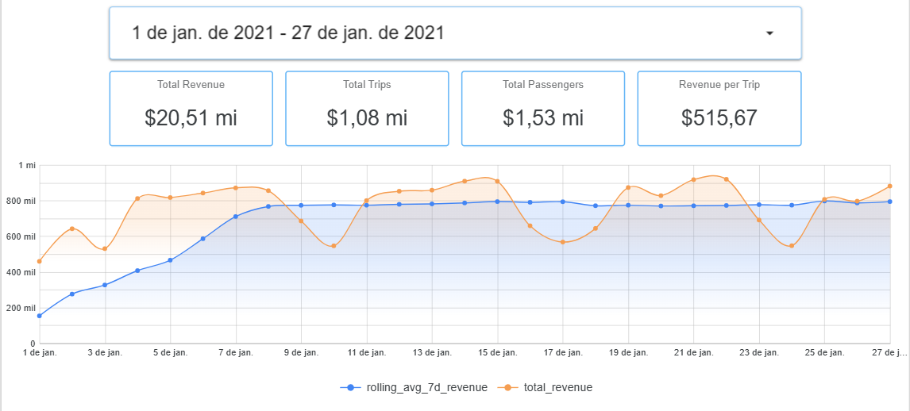

# NYC Taxi Data Pipeline | End-to-End Data Engineering Project

## Overview

This project demonstrates a complete end-to-end data engineering pipeline using NYC Taxi data. It covers ingestion, transformation, orchestration, and visualization using a modern data stack.

The goal is to simulate a real-world analytics workflow used by data teams in production environments.

---

## Architecture

This project follows the **Medallion Architecture**:

* **Bronze Layer** → Raw data ingestion (CSV files)
* **Silver Layer** → Cleaned and structured data (Parquet)
* **Gold Layer** → Aggregated business metrics for analytics

---

## Tech Stack

* **Python** → Data ingestion & processing
* **Docker** → Containerized environment
* **Kestra** → Workflow orchestration
* **Google Cloud Storage (GCS)** → Data lake
* **BigQuery** → Data warehouse
* **dbt** → Data transformation & modeling
* **Looker Studio** → Data visualization

---

## Pipeline Flow

1. Extract NYC Taxi data from public dataset
2. Load raw data into GCS (Bronze)
3. Transform data into Parquet format (Silver)
4. Aggregate KPIs (Gold layer)
5. Load curated data into BigQuery
6. Build analytical models using dbt
7. Create an interactive dashboard in Looker Studio

---

## Key Metrics

* Total Revenue
* Total Trips
* Total Passengers
* Revenue per Trip
* Revenue per Passenger
* Daily Revenue Change
* 7-day Rolling Average
* Weekly Revenue Growth

---

## Dashboard

The dashboard includes:

* Revenue trend with moving average
* KPI scorecards
* Interactive date filtering
* Business performance insights

---

## Insights

* Clear weekly seasonality patterns
* Revenue fluctuations across different days
* Trend smoothing using rolling averages
* Identification of potential anomalies

---

## Future Improvements

* Implement incremental models in dbt
* Add more data quality tests
* Optimize BigQuery cost and performance
* Introduce advanced anomaly detection

---

## Author

Ricardo Sanches
