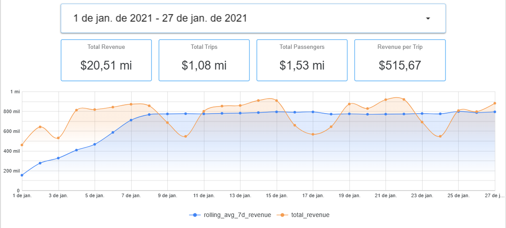
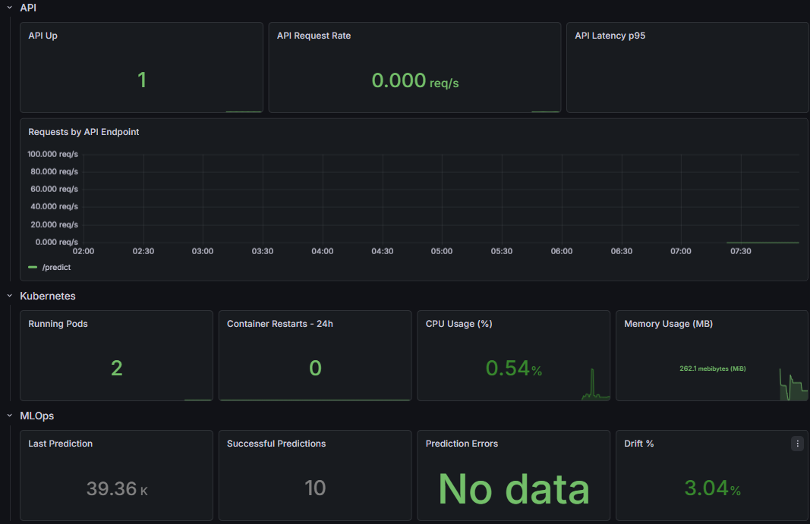
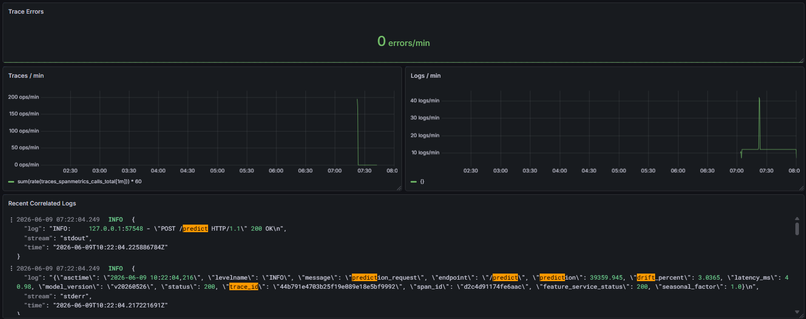

# NYC Taxi Data Platform | Data Engineering, MLOps & Observability

## Overview

This project evolved from a traditional NYC Taxi Data Pipeline into a complete Data Engineering, MLOps, and Observability Platform.

The platform demonstrates the full lifecycle of a modern data and machine learning ecosystem, including data ingestion, transformation, orchestration, model serving, monitoring, distributed tracing, and cloud-native deployment.

The objective is to simulate a production-grade architecture commonly used by Data Engineers, MLOps Engineers, Platform Engineers, and Site Reliability Engineering (SRE) teams.

---

## Project Highlights

* End-to-End Data Engineering Pipeline
* Production-Style ML Inference API
* Kubernetes Deployment
* Distributed Tracing with OpenTelemetry
* Log-Trace Correlation
* Model Drift Detection
* Centralized Observability Stack
* Automated Alerting
* Multi-Service Architecture
* Cloud-Native Deployment

---

## Platform Components

### Data Engineering

* Kestra
* Google Cloud Storage (GCS)
* BigQuery
* dbt
* Looker Studio

### MLOps

* FastAPI
* MLflow
* Feature Service
* Model Versioning
* Prediction Monitoring
* Drift Detection

### Observability

* Prometheus
* Grafana
* Loki
* Tempo
* OpenTelemetry

### Infrastructure

* Docker
* Kubernetes

---

## Architecture

### Data Pipeline

```text
CSV Files
   ↓
Google Cloud Storage (Bronze)
   ↓
BigQuery (Silver)
   ↓
dbt Models (Gold)
   ↓
Looker Studio
```

### MLOps Pipeline

```text
Client Request
   ↓
FastAPI Prediction API
   ↓
Feature Service
   ↓
MLflow Model
   ↓
Prediction Response
```

### Observability Pipeline

```text
Metrics  → Prometheus → Grafana

Logs     → Loki       → Grafana

Traces   → Tempo      → Grafana

OpenTelemetry → Tempo
```

---

## Dashboards

### Business Analytics Dashboard (Looker Studio)



Provides business insights such as:

* Revenue Trends
* Total Trips
* Passenger Metrics
* Revenue per Passenger
* Rolling Averages
* KPI Scorecards

---

### Taxi Platform - Operations & MLOps



Monitors:

* API Health
* Request Rate
* API Latency
* Prediction Volume
* Prediction Errors
* Drift Percentage
* Kubernetes Resources
* CPU Usage
* Memory Usage

---

### Taxi Platform - End-to-End Observability



Monitors:

* Traces per Minute
* Logs per Minute
* Trace Errors
* Correlated Logs
* Distributed Tracing
* Log ↔ Trace Correlation

---

## Dashboard Exports

Grafana dashboard definitions are available in:

* `dashboard/operations_mlops_dashboard.json`
* `dashboard/end_to_end_observability_dashboard.json`

---

## Key Achievements

* End-to-End Data Engineering Pipeline
* Production-Style ML Inference API
* Kubernetes Deployment
* Distributed Tracing with OpenTelemetry
* Log-Trace Correlation
* Model Drift Monitoring
* Centralized Observability Stack
* Automated Alerting
* Multi-Service Architecture
* Cloud-Native Deployment

---

## Key Technologies

Python • FastAPI • MLflow • Docker • Kubernetes • Prometheus • Grafana • Loki • Tempo • OpenTelemetry • Kestra • BigQuery • dbt • Looker Studio

---

## Future Improvements

* CI/CD Automation
* Infrastructure as Code (Terraform)
* Feature Store Integration
* Data Quality Monitoring
* SLO / SLI Dashboards
* Cloud-Native Deployment Automation

---

## Author

Ricardo Sanches
