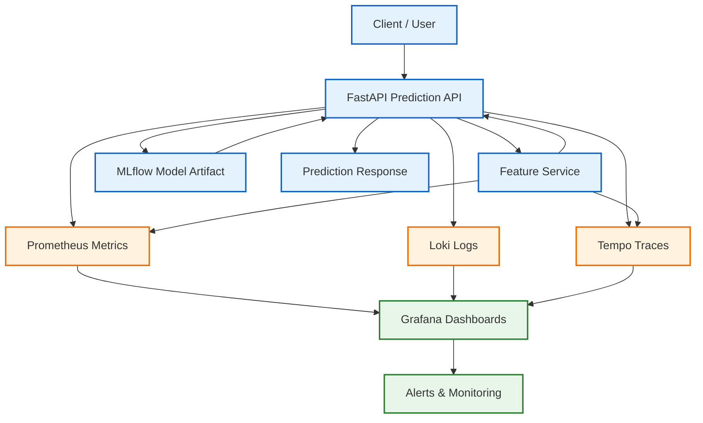

# NYC Taxi Data Platform | Data Engineering, MLOps & Observability

## Overview

This project evolved from a traditional NYC Taxi Data Pipeline into a complete Data Engineering, MLOps, and Observability Platform.

The platform demonstrates the full lifecycle of a modern data and machine learning ecosystem, including data ingestion, transformation, orchestration, model serving, monitoring, distributed tracing, and cloud-native deployment.

The objective is to simulate a production-grade architecture commonly used by Data Engineers, MLOps Engineers, Platform Engineers, and Site Reliability Engineering (SRE) teams.

---

## Project Highlights

* End-to-End Data Engineering Pipeline
* Production-Style ML Inference API
* Kubernetes Deployment
* Distributed Tracing with OpenTelemetry
* Log-Trace Correlation
* Model Drift Detection
* Centralized Observability Stack
* Automated Alerting
* Multi-Service Architecture
* Cloud-Native Deployment

---

## Architecture


```mermaid
flowchart TD
    Client[Client / User] --> API[FastAPI Prediction API]

    API --> FeatureService[Feature Service]
    API --> MLflow[MLflow Model Artifact]

    FeatureService --> API
    MLflow --> API

    API --> Prediction[Prediction Response]

    API --> Prometheus[Prometheus Metrics]
    API --> Loki[Loki Logs]
    API --> Tempo[Tempo Traces]

    FeatureService --> Prometheus
    FeatureService --> Tempo

    Prometheus --> Grafana[Grafana Dashboards]
    Loki --> Grafana
    Tempo --> Grafana

    Grafana --> Alerts[Alerts & Monitoring]

    classDef app fill:#e3f2fd,stroke:#1565c0,stroke-width:2px;
    classDef observability fill:#fff3e0,stroke:#ef6c00,stroke-width:2px;
    classDef dashboard fill:#e8f5e9,stroke:#2e7d32,stroke-width:2px;

    class Client,API,FeatureService,MLflow,Prediction app;
    class Prometheus,Loki,Tempo observability;
    class Grafana,Alerts dashboard;
```

---

## Platform Components

### Data Engineering

* Kestra
* Google Cloud Storage (GCS)
* BigQuery
* dbt
* Looker Studio

### MLOps

* FastAPI
* MLflow
* Feature Service
* Model Versioning
* Prediction Monitoring
* Drift Detection

### Observability

* Prometheus
* Grafana
* Loki
* Tempo
* OpenTelemetry

### Infrastructure

* Docker
* Kubernetes
* Google Cloud Run
* GitHub Actions

---

## Platform Workflows

### Data Pipeline

```text
CSV Files
   ↓
Google Cloud Storage (Bronze)
   ↓
BigQuery (Silver)
   ↓
dbt Models (Gold)
   ↓
Looker Studio
```

### MLOps Pipeline

```text
Client Request
   ↓
FastAPI Prediction API
   ↓
Feature Service
   ↓
MLflow Model
   ↓
Prediction Response
```

### Observability Pipeline

```text
Metrics  → Prometheus → Grafana

Logs     → Loki       → Grafana

Traces   → Tempo      → Grafana

OpenTelemetry → Tempo
```

---

## Dashboards

### Business Analytics Dashboard (Looker Studio)


Provides business insights such as:

* Revenue Trends
* Total Trips
* Passenger Metrics
* Revenue per Passenger
* Rolling Averages
* KPI Scorecards

---

### Taxi Platform – Operations & MLOps


Monitors:

* API Health
* Request Rate
* API Latency
* Prediction Volume
* Prediction Errors
* Drift Percentage
* Kubernetes Resources
* CPU Usage
* Memory Usage

---

### Taxi Platform – End-to-End Observability


Monitors:

* Traces per Minute
* Logs per Minute
* Trace Errors
* Correlated Logs
* Distributed Tracing
* Log ↔ Trace Correlation

---

## Dashboard Exports

Grafana dashboard definitions are available in:

* `dashboard/operations_mlops_dashboard.json`
* `dashboard/end_to_end_observability_dashboard.json`

---

## Release

Current stable release:

**v1.0.0 — NYC Taxi Data Platform**

Published on GitHub Releases.

---

## Key Achievements

* Designed and deployed an end-to-end machine learning prediction platform using FastAPI and MLflow.
* Implemented distributed tracing using OpenTelemetry and Grafana Tempo.
* Built a centralized observability stack with Prometheus, Loki, Grafana, and Tempo.
* Created production-style dashboards for metrics, logs, traces, and model monitoring.
* Implemented model drift detection and automated alerting workflows.
* Deployed cloud-native workloads using Docker, Kubernetes, and Google Cloud Run.
* Established log-to-trace correlation for faster incident investigation and troubleshooting.

---

## Key Technologies

Python • FastAPI • MLflow • Docker • Kubernetes • Prometheus • Grafana • Loki • Tempo • OpenTelemetry • Kestra • BigQuery • dbt • Looker Studio • Google Cloud Run • GitHub Actions

---

## Future Improvements

* Terraform Infrastructure as Code
* Service Graph Visualization
* Trace-to-Logs Navigation
* Feature Store Integration
* Data Quality Monitoring
* SLO / SLI Dashboards
* Multi-Environment Deployment Strategy

---

## Author

Ricardo Sanches

Data Engineer | MLOps Enthusiast | Cloud & Observability Practitioner

GitHub:
https://github.com/ricardopsanches-data-engineer
